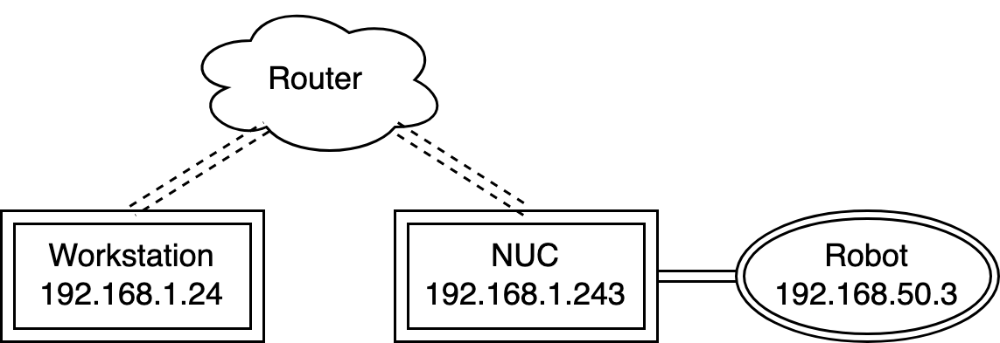

<div align='center'>
<h2 align="center"> Spot-Compose: A Framework for Open-Vocabulary Object Retrieval and
Drawer Manipulation in Point Clouds </h2>
<h3 align="center">ICRA 2024 Mobile Manipulation and Embodied Intelligence Workshop (MOMA.v2)</h3>

<a href="https://oliver-lemke.github.io/">Oliver Lemke</a><sup>1</sup>, <a href="https://zuriabauer.com/">Zuria Bauer</a><sup>1</sup>, <a href="https://scholar.google.com/citations?user=feJr7REAAAAJ&hl=en">René Zurbrügg</a><sup>1</sup>, <a href="https://people.inf.ethz.ch/marc.pollefeys/">Marc Pollefeys</a><sup>1,2</sup>, <a href="https://francisengelmann.github.io/">Francis Engelmann</a><sup>1</sup>, <a href="https://hermannblum.net/">Hermann Blum</a><sup>1</sup>

<sup>1</sup>ETH Zurich <sup>2</sup>Microsoft Mixed Reality & AI Labs

Spot-Compose presents a comprehensive framework for integration of modern machine perception techniques with Spot, showing experiments with object grasping and dynamic drawer manipulation.


</div>

[[Project Webpage](https://spot-compose.github.io/)]
[[Paper]() (coming soon!)]


# News :newspaper:
* **April 23rd**: release of teaser video.
* **April 22nd**: release on arXiv.
* **March 13th 2024**: Code released.

# Code Structure :clapper:


```
spot-compose/
├── source/                            # All source code
│   ├── utils/                         # General utility functions
│   │   ├── coordinates.py             # Coordinate calculations (poses, translations, etc.)
│   │   ├── docker_communication.py    # Communication with docker servers
│   │   ├── environment.py             # API keys, env variables
│   │   ├── files.py                   # File system handling
│   │   ├── graspnet_interface.py      # Communication with graspnet server
│   │   ├── importer.py                # Config-based importing
│   │   ├── mask3D_interface.py        # Handling of Mask3D instance segmentation
│   │   ├── point_clouds.py            # Point cloud computations
│   │   ├── recursive_config.py        # Recursive configuration files
│   │   ├── scannet_200_labels.py      # Scannet200 labels (for Mask3D)
│   │   ├── singletons.py              # Singletons for global unique access
│   │   ├── user_input.py              # Handle user input
│   │   ├── vis.py                     # Handle visualizations
│   │   ├── vitpose_interface.py       # Handle communications with VitPose docker server
│   │   └── zero_shot_object_detection.py # Object detections from images
│   ├── robot_utils/                   # Utility functions specific to spot functionality
│   │   ├── base.py                    # Framework and wrapper for all scripts
│   │   ├── basic_movements.py         # Basic robot commands (moving body / arm, stowing, etc.)
│   │   ├── advanced_movements.py      # Advanced robot commands (planning, complex movements)
│   │   ├── frame_transformer.py       # Simplified transformation between frames of reference
│   │   ├── video.py                   # Handle actions that require access to robot cameras
│   │   └── graph_nav.py               # Handle actions that require access to GraphNav service
│   └── scripts/
│       ├── my_robot_scripts/
│       │   ├── estop_nogui.py         # E-Stop
│       │   └── ...                    # Other action scripts
│       └── point_cloud_scripts/
│           ├── extract_point_cloud.py # Extract point cloud from Boston Dynamics autowalk
│           ├── full_align.py          # Align autowalk and scanned point cloud
│           └── vis_ply_point_clouds_with_coordinates.py # Visualize aligned point cloud
├── data/
│   ├── autowalk/                      # Raw autowalk data
│   ├── point_clouds/                  # Extracted point clouds from autowalks
│   ├── prescans/                      # Raw prescan data
│   ├── aligned_point_clouds/          # Prescan point clouds aligned with extracted autowalk clouds
│   └── masked/                        # Mask3D output given aligned point clouds
├── configs/                           # configs
│   └── config.yaml                    # Uppermost level of recursive configurations (see configs sections for more info)
├── shells/
│   ├── estop.sh                       # E-Stop script
│   ├── mac_routing.sh                 # Set up networking on workstation Mac
│   ├── ubuntu_routing.sh              # Set up networking on workstation Ubuntu
│   ├── robot_routing.sh               # Set up networking on NUC
│   └── start.sh                       # Convenient script execution
├── README.md                          # Project documentation
├── requirements.txt                   # pip requirements file
├── pyproject.toml                     # Formatter and linter specs
└── LICENSE
```

## Dependencies :memo:

The main dependencies of the project are the following:
```yaml
python: 3.8
```
You can set up a pip environment as follows :
```bash
git clone --recurse-submodules git@github.com:oliver-lemke/spot-compose.git
cd spot-compose
virtualenv --python="/usr/bin/python3.8" "venv/"
source venv/bin/activate
pip install -r requirements.txt
```

## Downloads :droplet:
The pre-trained model weigts for Yolov-based drawer detection is available [here](https://drive.google.com/file/d/11axGmSgb3zmUtq541hH2TCZ54DwTEiWi/view?usp=drive_link).

## Docker Containers :whale:
Docker containers are used to run external neural networks. This allows for easy modularity when working with multiple methods, without tedious setup.
Each docker container funtions as a self-contained server, answering requests. Please refer to `utils/docker_communication.py` for your own custon setup, or to the respective files in `utils/` for existing containers.

To run the respective docker container, please first pull the desired image via 
```bash
docker pull [Link]
```
Once docker has finished pulling the image, you can start a container via the `Run Command`.
When you are inside the container shell, simply run the `Start Command` to start the server.


|      Name       |                                                                                   Link                                                                                   |                             Run Command                              |               Start Command               |
|:---------------:|:------------------------------------------------------------------------------------------------------------------------------------------------------------------------:|:--------------------------------------------------------------------:|:-----------------------------------------:|
|    AnyGrasp     | [craiden/graspnet:v1.0](https://hub.docker.com/layers/craiden/graspnet/v1.0/images/sha256-ec5663ce991415a51c34c00f2ea6f8ab9303a88e6ac27d418df2193c6ab40707?context=repo) |  ```docker run -p 5000:5000 --gpus all -it craiden/graspnet:v1.0```  |           ```python3 app.py```            |
|   OpenMask3D    | [craiden/openmask:v1.0](https://hub.docker.com/layers/craiden/openmask/v1.0/images/sha256-023e04ebecbfeb62729352a577edc41a7f12dc4ce780bfa8b8e81eb54ffe77f7?context=repo) |  ```docker run -p 5001:5001 --gpus all -it craiden/openmask:v1.0```  |           ```python3 app.py```            |
|     ViTPose     |  [craiden/vitpose:v1.0](https://hub.docker.com/layers/craiden/vitpose/v1.0/images/sha256-43a702300a0fffa2fb51fd3e0a6a8d703256ed2d507ac0ba6ec1563b7aee6ee7?context=repo)  |  ```docker run -p 5002:5002 --gpus all -it craiden/vitpose:v1.0```   | ```easy_ViTPose/venv/bin/python app.py``` |
| DrawerDetection | [craiden/yolodrawer:v1.0](https://hub.docker.com/layers/craiden/yolodrawer/v1.0/images/sha256-2b0e99d77dab40eb6839571efec9789d6c0a25040fbb5c944a804697e73408fb?context=repo) | ```docker run -p 5004:5004 --gpus all -it craiden/yolodrawer:v1.0``` |           ```python3 app.py```            |


# Detailed Setup Instructions
## Point Clouds :cloud:
For this project, we require two point clouds for navigation (low resolution, captured by Spot) and segmentation (high resolution, capture by commodity scanner).
The former is used for initial localization and setting the origin at the apriltag fiducial. The latter is used for accurate segmentation.

### Low-Resolution Spot Point Cloud
To capture the point cloud please position Spot in front of your AptrilTag and start the [autowalk](https://support.bostondynamics.com/s/article/Getting-Started-with-Autowalk).
Zip the resulting and data and unzip it into the `data/autowalk` folder.
Fill in the name of the unzipped folder in the config file under `pre_scanned_graphs/low_res`.

### High-Resolution Commodity Point Cloud
To capture the point cloud we use the [3D Scanner App](https://apps.apple.com/us/app/3d-scanner-app/id1419913995) on iOS.
Make sure the fiducial is visible during the scan for initialization.
Once the scan is complete, click on `Share` and export two things:

1. `All Data`
2. `Point Cloud/PLY` with the `High Density` setting enabled and `Z axis up` disabled

Unzip the `All Data` zip file into the `data/prescans` folder. Rename the point cloud to `pcd.ply` and copy it into the folder, such that the resulting directory structure looks like the following:

```
prescans/
├── all_data_folder/
│   ├── annotations.json
│   ├── export.obj
│   ├── export_refined.obj
│   ├── frame_00000.jpg
│   ├── frame_00000.json
│   ├── ...
│   ├── info.json
│   ├── pcd.ply.json
│   ├── textured_output.jpg
│   ├── textured_output.mtl
│   ├── textured_output.obj
│   ├── thumb_00000.jpg                
│   └── world_map.arkit
```

Finally, fill in the name of your `all_data_folder` in the config file under `pre_scanned_graphs/high_res`.

## Networking :globe_with_meridians:

In our project setup, we connect the robot via a NUC on Spot's back. The NUC is connected to Spot via cable, and to a router via WiFi.

<p align="center">
    
</p>

However, since the robot is not directly accessible to the router, we have to (a) tell the workstation where to send information to the robot, and (b) tell the NUC to work as a bridge.
You may have to adjust the addresses in the scripts to fit your setup.

### Workstation Networking
On the workstation run `./shells/ubuntu_routing.sh` (or `./shells/mac_routing.sh` depending on your workstation operating system).

### NUC Networking
First, ssh into the NUC, followed by running `./robot_routing.sh` to configure the NUC as a network bridge.


## Config :gear:
The base config file can be found under configs/config.yaml.
However, our config system allows for dynamically extending and inheriting from configs, if you have different setups on different workstations.
To do this, simply specify the bottom-most file in the inheritance tree when creating the `Config()` object. Each config file specifies the file it inherits from in an `extends` field.

In our example, the overwriting config is specified in `configs/template_extension.yaml`, meaning the inheritance graph looks like:
```
template_extension.yaml ---overwrites---> config.yaml
```
In this example, we would specify `Config(file='configs/template_extension.yaml')`, which then overwrites all the config files it extends.

However, this functionality is not necessary for this project to work, so simply working with the `config.yaml` file as you are used to is supported by default.


# Benchmark :chart_with_upwards_trend:
We provide detailed results here.

## Open-Vocabulary Object Retrieval


## Dynamic Drawer Manipulation & Search


# TODO :soon:
- [ ] Finish Documentation


# BibTeX :pray:
```
@inproceedings{lemke2024spotcompose,
  title={Spot-Compose: A Framework for Open-Vocabulary Object Retrieval and Drawer Manipulation in Point Clouds},
  author={Oliver Lemke and Zuria Bauer and Ren{\'e} Zurbr{\"u}gg and Marc Pollefeys and Francis Engelmann and Hermann Blum},
  booktitle={2nd Workshop on Mobile Manipulation and Embodied Intelligence at ICRA 2024},
  year={2024},
}
```
